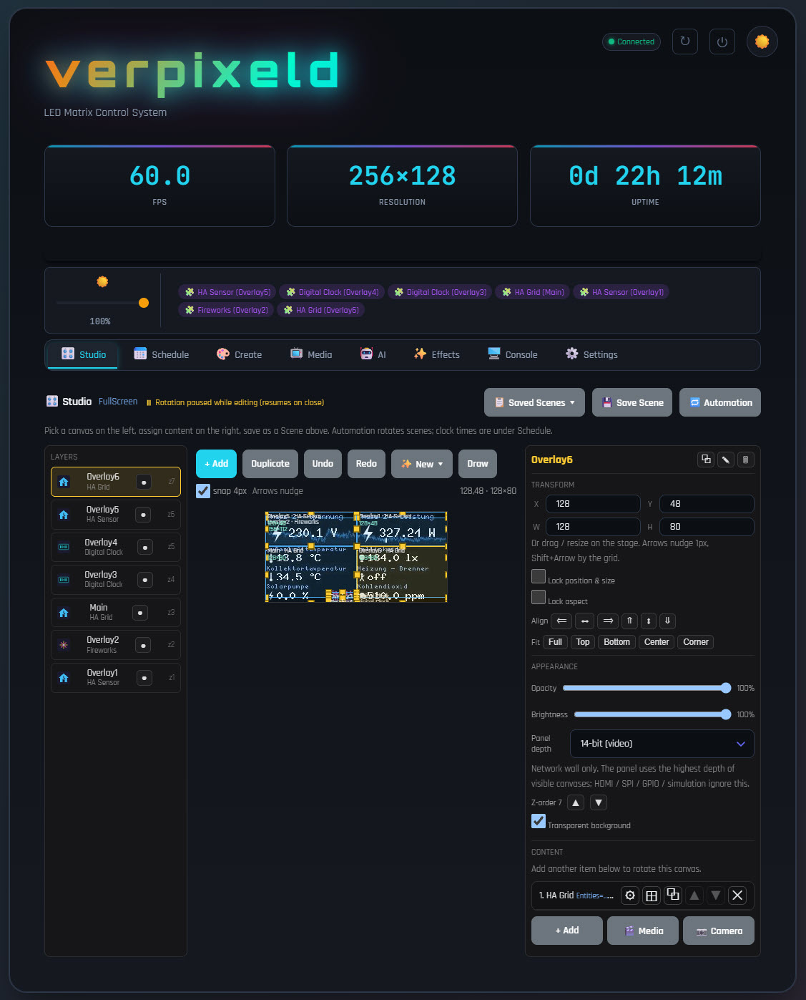

<p align="center">
  
</p>

---
<details>
<summary>2026-02-15: Major overhaul of web-gui to optimize UX</summary>
<div align="center">

</div>
</details>

---
<details>
<summary>2026-01-30: Sneak peek of the web-gui...</summary>
<div align="center">

</div>
</details>

---
<div align="center">

</div>

---
<div align="center">

# 🎨 verpixeld

### LED Matrix Control System

*Transform your RGB LED matrix into a dynamic, controllable display*

[](https://dotnet.microsoft.com/)
[](https://www.raspberrypi.org/)
[](#-license)

</div>

---

## 🌟 What is verpixeld?

**verpixeld** is a .NET 10 LED display host: it composes multi-layer canvas content and drives it from one web UI. It started on a Raspberry Pi with HUB75 panels and now talks to several output backends. **Network output** can run on the Pi or in **Docker on a NAS** (linux-x64); GPIO still needs the Pi.

| `App.OutputMode` | Backend | Typical hardware |
|------------------|---------|------------------|
| `gpio` | [rpi-rgb-led-matrix](https://github.com/hzeller/rpi-rgb-led-matrix) | Pi GPIO → HUB75 wall |
| `network` | [PixPlane](https://github.com/Jan1503/pixplane) UDP :7777 | [verpixeld-panel](https://github.com/Jan1503/verpixeld-panel) (RP2350 + W6300, ICND1065L 256×128) |
| `hdmi` | Linux framebuffer `/dev/fb0` | HDMI → sender card (Colorlight / Novastar style) |
| `spi` | SPI `VPX2` bit-planes | Pi → RP2040 receiver bridge |
| `simulation` | no-op + MJPEG preview | Any machine, no panel |

Switch backends in **Settings → Output**. Network / HDMI / SPI / simulation can live-swap when the pixel size matches. GPIO always needs a process restart (the native matrix library owns realtime GPIO). GPIO init failure falls back to simulation so the web UI stays up.

The canvas engine, extensions and filters live in the sibling [CanvasManagement](#-related-projects) library. Desktop capture is [DeskCast](https://github.com/Jan1503/deskcast).

Whether you want to show the time, display weather information, run animations, stream your camera, play YouTube videos, or create collaborative pixel art – verpixeld provides a unified platform with:

- 🖥️ **Beautiful Web Control Panel** — Control everything from any device with a browser
- 🧩 **Plugin Architecture** — Extend functionality with custom content extensions
- 🎨 **Real-time Visual Filters** — Apply effects like blur, color correction, and more
- 📐 **Flexible Layouts** — Multi-canvas support with independent layers and opacity
- ⏰ **Smart Scheduling** — Automate content changes based on time
- 🌙 **Night Mode** — Automatic brightness adjustment for different times of day
- 📷 **Camera Streaming** — Stream live video from your phone to the display
- ✏️ **Drawing Mode** — Create pixel art directly on the display
- 🎬 **Media Player** — Full video/audio playback with YouTube, network shares, and local files
- ⭐ **Favorites & History** — Save and quickly replay media with remembered settings
- 🔊 **Bluetooth Audio** — Output audio to Bluetooth speakers via PulseAudio
- 📹 **Camera Motion Alerts** — Auto-switch to a camera feed when motion is detected
- 🖼️ **Image & Video Upload** — Upload photos or stream video clips from any device to the display
- 🏠 **Home Assistant Integration** — Live tiles (sensor, grid, graph, energy, weather, now-playing, climate, waste, **departures**), configurable wall toasts, and the wall itself as an MQTT device (notify, layout, brightness, night mode)
- 🧲 **Live Layer Editor** — Drag, resize, duplicate, lock, nudge and undo canvases over the live preview; per-canvas brightness, opacity, and overlap hatching
- 🕒 **Rich Clocks & Extensions** — Flexible Digital Clock (12/24h, BDF/seven-segment, glow, colour cycle) plus many extensions: games (Pac-Man, Snake, Pong, Tetris, Pixel Plumber, Street Crosser, Rainbow Breakout, Bubble Pop, Bomber Maze, Fruit Fall, Space Invaders, Dino, Flappy Bird), Weather, News Ticker, Now Playing, Falling Sand, and more
- 🎮 **Play games from Studio** — The wall has no keyboard. Keys in the browser invoke **Controls** methods (`KeyboardShortcut`) on the selected game canvas; AutoPilot stops on the first key
- 🤖 **AI Art Generation** — Generate images with Azure OpenAI or OpenAI, with image-to-image stylization, gallery storage, and scheduled auto-generation
- 🎙️ **Voice Assistant** — Hands-free voice commands with wake word detection, fast-path instant execution, intent classification, spoken responses with audio ducking, via Azure Speech + OpenAI
- 🎵 **Music Search & Radio** — Search and play YouTube Music songs, start endless genre radio, or tune into internet radio stations (Radio Browser) by voice or through the web UI
- 📹 **Voice Camera Control** — Show or dismiss camera feeds (IP/RTSP alert camera or USB webcam) by voice command
- 📺 **Live Matrix Preview** — Real-time MJPEG stream of the LED matrix output viewable from the web UI, with scalable pixelated rendering
- 🖥️ **Simulation Mode** — Run the full application without physical LED hardware for development and testing
- 🔒 **Certificate Management** — Upload custom HTTPS certificates or regenerate self-signed ones through the web interface
- 📡 **Network panels** — Discover (`VPXD` UDP 7778), bind by chip-id (DHCP-safe), identify-flash, live 8/14-bit depth from visible canvases, and a 9-point seam curve for the ICND scan-home columns
- 🖥️ **HDMI / SPI outputs** — Drive a sender card via framebuffer, or an RP2040 SPI bridge
- 🪟 **DeskCast** — Windows region/window capture straight to the panel (PixPlane) or into verpixeld via the Network Stream Player (TPM2.NET)

---

## 🔗 Related projects

Local layout (siblings under `RGB-Display/`):

```
verpixeld/           this host (web UI, media, outputs)
  docker/            NAS image (Dockerfile, compose, build.ps1)
CanvasManagement/    canvas engine, extensions, filters, deploy.ps1
pixplane/            BGRA → bit-plane UDP library
DesktopStreamer/     DeskCast (Windows capture)
verpixeld-panel/     RP2350 + W6300 firmware
```

| Repo | Role |
|------|------|
| [verpixeld](https://github.com/Jan1503/verpixeld) | This application |
| [canvasmanagement](https://github.com/Jan1503/canvasmanagement) | Canvas engine, extensions, filters, `deploy.ps1` |
| [pixplane](https://github.com/Jan1503/pixplane) | Panel protocol (stream, discovery, `/cmd`) |
| [verpixeld-panel](https://github.com/Jan1503/verpixeld-panel) | ICND1065L firmware 1.7 |
| [deskcast](https://github.com/Jan1503/deskcast) | Windows desktop → panel or verpixeld |
| [rpi-rgb-led-matrix](https://github.com/hzeller/rpi-rgb-led-matrix) | GPIO HUB75 driver (not vendored) |

CanvasManagement is the shared framework ([Jan1503/canvasmanagement](https://github.com/Jan1503/canvasmanagement)).

---

## What's new

Dated from the public GitHub history so you can follow what landed when. Newest first.

### 2026-08-29 — Voice settings live with the other AI settings

**Apply to Display** now has **Dismiss from Display** next to it (Generate, Stylize, Gallery, History). Save to Gallery hashes the PNG: the same image is not written again under a new timestamp; a second click asks whether to keep another copy. Voice settings are grouped (Speech, mic, listening, spoken answers, commands) with a short note under each field. Azure AI Foundry uses one key for OpenAI and Speech — leave Speech key empty to reuse the Azure OpenAI key.

Speech key, microphone, TTS, ducking and wake-word upload moved from the Voice subtab into **AI → Settings**, together with voice image defaults. **Save All Settings** writes Azure/image/chat and voice in one go. The Voice tab is listen / push-to-talk only.

### 2026-08-28 — AI Art for the LED wall

Generated images are **center-cropped** to the wall aspect and **nearest-neighbour** scaled (pixel-art / 8-bit also posterize). Previews use the live display size. **Save to Gallery** writes a PNG. Gallery and history can send an image to **Stylize**. Apply draws an overlay on the **selected canvas**, not always full-screen. Auto-generate shows last/next run and **Run now**. History stores files under `Data/AiHistory/` instead of base64 in JSON. Content-filter and rate-limit errors show as plain toasts.

### 2026-08-27 — Studio layout tools, container restart

Studio can **duplicate** a canvas (geometry, brightness, opacity, extension + params, rotation playlist). Inspector has **per-canvas brightness**, **lock position & size**, and **lock aspect**. Arrow keys nudge 1 px (Shift = snap grid); Alt+Arrow always nudges so games keep their own arrows. Ctrl+Z / Ctrl+Y undo move, resize, z-order, opacity and brightness. The selected box hatches pixels covered by a higher z-order layer.

The header **reboot** button detects Docker (`DOTNET_RUNNING_IN_CONTAINER` / `/.dockerenv`) and **stops the process** instead of `systemctl reboot`. Compose `restart: unless-stopped` brings the container back; the NAS is not rebooted. On a Pi it still reboots the host.

Settings → Output greys out **HDMI**, **SPI** and **Hardware (GPIO)** in Docker — those need Pi devices. Network and Simulation stay. The API rejects a switch to the blocked modes so a stale config cannot enable them.

### 2026-08-26 — Studio keyboard for games, Docker media paths

The LED wall has no keyboard. Studio now binds keys to extension methods whose `Category` is **Controls** (`wwwroot/js/features/game-input.js`). Shortcuts show as `<kbd>` on the method buttons. Typing in inputs is ignored; key-repeat is ignored. `POST /api/layout/invoke/{canvas}` accepts `args` **or** `parameters`. The first key takes over from AutoPilot — see the game list in [CanvasManagement](https://github.com/Jan1503/canvasmanagement).

Layer editor **Add Media** lists the recursive NAS library (`GET /api/media/videos`) with a wait state so a large share does not look frozen. Video rotation resolves files against `Media/` as well as `Media/Videos/`, so a Docker mount with movies at `Media/Movies/…` actually plays.

### 2026-08-24 — Docker on a NAS, local media browser

The host can run as a **linux-x64 Docker image** (`verpixeld:nas`) on TrueNAS / Portainer and send PixPlane UDP to the wall. GPIO, HDMI, SPI and Pulse/ALSA stay on the Pi — the container is **network output only**. Do not run the Pi host and the container at the same time (both would send to UDP 7777).

Build on a machine with Docker: `docker/build.ps1 -Tar`, then Portainer **Images → Import**. Compose example: `docker/docker-compose.yml` (set `Network__Host` to the panel IP). Volumes: **Data** (layouts, plugins, fonts), **Config** (settings overlay, certs, seam JSON), **Media** (NAS library, typically read-only). The image bakes Fonts / Extensions / Filters and seeds them into Data. Config saves go to `/app/Config` so a recreate does not keep GPIO or a Pi resolution from the bundled JSON.

The image compiles **FFmpeg 7.1 with libsmbclient** (Ubuntu’s ffmpeg has no `smb` protocol), plus **smbclient**, **yt-dlp**, and **LibVLC** so the VLC Media Player extension can load. LibVLC adds a lot of size (codecs + plugins). Skip it if you only use FFmpeg/yt-dlp: `docker/build.ps1 -SkipVlc -Tar` (or `docker build --build-arg VLC=0`). YouTube and Network Shares work without compiling FFmpeg on the NAS. There is no sound card in the container: video still plays; ALSA is skipped so FFmpeg does not die before the first frame. Mute VLC (or leave audio off) — there is nothing to play into. `homeassistant.local` is mDNS — Docker bridge DNS will not resolve it; use the LAN IP or `extra_hosts`.

**Local Media** is the same folder browser as Network Shares (`GET /api/media/browse`). Docker lists `/app/Media`; the Pi still uses `Media/Videos` and `Media/Audio` next to the DLL. MKV/HEVC duration comes from `format.duration` (stream duration is often `N/A`), so the seek bar works. Nested paths play without `%2F` 404s.

Packed UDP send stays on a latest-wins thread. High-motion video stays dirty-deltas in [PixPlane](https://github.com/Jan1503/pixplane) (keys = first frame + 1s recovery).

The Pi install path is unchanged: persist next to `verpixeld.dll`, Pulse/ALSA audio, `~/verpixeld/Media/Videos`.

### 2026-08-23 — Composition root, scheduler, tests

The host is built from DI. `Program` parses CLI and runs Kestrel; `AddVerpixeldHost` registers the process-lifetime graph. `OutputRuntime.Start()` runs on first resolve so `CanvasManager` is sized from the live renderer. `HostOrchestrator` loads the default scene and wires the clock scheduler — timed layouts call `ILayoutLoaderService.LoadLayoutAsync` again (that path had been disconnected).

Media targeting empty/`Main` plays on a dedicated **MediaPlayer** overlay canvas so Main stays free for extensions. HA toast / voice / camera-alert overlays stay in Studio for placement but are not valid content-picker targets.

`verpixeld.Tests` (xUnit, no hardware/Kestrel) covers filter-parameter roundtrip, layout files in a temp directory, seam JSON (including legacy `columns` → 14-bit), the Main→MediaPlayer remap, and the scheduler handler. `dotnet test` from this repo runs on Windows without a Pi.

Studio: Camera Alert sits under Create (with the USB camera), GPIO/seam/HA use in-box disclosure arrows, and the media warning names the canvas that actually plays video.

### 2026-08-22 — Home Assistant: wall as a device, and better toasts

The wall can register as an MQTT device in Home Assistant (needs the MQTT integration / Mosquitto addon). Settings → Home Assistant → **Expose as HA device**.

| Entity | What it does |
|--------|----------------|
| `notify.verpixeld_wall` | Send a toast from automations (`notify.send_message`). MQTT notify entities have **no state**, so HA shows this as “unknown” — that is expected. |
| `text.verpixeld_toast` | Text field on a dashboard: type, submit, toast on the wall |
| `sensor.verpixeld_last_toast` | Last toast text; attributes hold title, severity, time |
| `select.verpixeld_layout` | Load a saved layout |
| `number.verpixeld_brightness` | Global brightness 0–100% |
| `switch.verpixeld_night_mode` | Enable the night-mode **schedule** (not “dim right now”) |
| `binary_sensor.verpixeld_night_active` | `on` only while the configured night window is in effect |

Wall toasts (persistent notifications, MQTT notify, dashboard text, or REST) are configurable: duration, BDF font, colours, default severity. Prefix HA `notification_id` with `error:`, `warning:`, `success:` or `info:` (or put `[error]` in the title) to pick the accent. Test from Settings without going through HA.

REST fallbacks: `POST /api/homeassistant/notify`, `POST /api/homeassistant/toast`.

Departure boards live in [CanvasManagement](https://github.com/Jan1503/canvasmanagement) as the **HA Departures** tile (HVV / HAFAS / RMV line badges).

### 2026-08-22 — Seam LUTs per colour depth, plugin hot-reload

Settings → Output → Network → **Seam correction** has separate **14-bit** and **8-bit** curves. Opening a tab live-locks the panel to that depth (`livemode`) so you calibrate the LUT you actually use. Plugin DLLs load from a memory copy; Settings → Plugins → **Reload plugins** (or `POST /api/plugins/reload`) picks up a new extension/filter without restarting the process.

### 2026-08-21 — 9-point scan-home seam curve

The ICND columns 63 / 127 / 191 / 255 get a 9-point 8-bit remap (plus optional gain/lift) before gamma. Host-side **Wall grey** fills the panel so you can match a neighbour column without the firmware test pattern bypassing the LUT. See [Scan-home seam correction](#scan-home-seam-correction).

### 2026-08-20 — Live 8/14-bit colour depth

Network walls follow the **max** `PanelColorBits` of visible canvases and switch with firmware 1.7 `livemode` — no panel reboot. Hide a 14-bit video canvas and a clock-only layout can drop back to 8-bit. See [Live 8/14-bit colour depth](#live-814-bit-colour-depth).

### 2026-08-19 — Public host

Initial public import: .NET 10 host, web UI, GPIO / network / HDMI / SPI / simulation outputs, media, voice, and the [CanvasManagement](https://github.com/Jan1503/canvasmanagement) sibling for canvases, extensions and filters.

---

## Scan-home seam correction

The four columns **63, 127, 191 and 255** on the 256×128 ICND wall do not match their neighbours. Highlights are too hot, shadows are too dead. That is a **known hardware issue**, not a bug in the composer.

### Why those four columns

The wall is two stacked 128×128 modules, 64-scan, with landscape mapping (`cfg_landscape + cfg_rot_cw + cfg_flip_x + cfg_flip_y`). `rowaddr 0` of each 1/64 scan group lands on those X coordinates. It is the **same physical first-line offset, shown four times** — not four module joints.

The offset is **nonlinear** (an S-curve): darker than the neighbour in the shadows *and* brighter in the highlights. Gain+lift (`out = in * Gain + Lift`) can squash contrast but cannot invert that curve. Chip registers (REG03 and similar) were already exhausted. Extra 595 slots, OE blanks or mux-phase tweaks on the RP2350 desynchronise the 595 from the ICND and add ghosts. The line cannot be made physically linear in firmware.

### What verpixeld does instead

[PixPlane](https://github.com/Jan1503/pixplane) remaps the 8-bit source **on those columns only**, before gamma:

```
9-point curve → 256-entry 8-bit LUT  →  global colour LUT  →  optional dither  →  Gain / Lift
```

Settings → Output → Network → **Seam correction** has two tabs (**14-bit** / **8-bit**). Each depth has its own curve — 14-bit video and 8-bit clocks do not match with one LUT. Opening a tab live-switches the panel to that depth (`livemode`); leaving Settings hands depth back to the visible canvases.

1. Pick the tab you want to match. Wait until the hint says the panel is locked to that depth.
2. Set **Gain/lift → 1 / 0** so only the curve is in play.
3. Turn **Wall grey** on (host fills the wall — firmware `t f` bypasses the LUT and cannot calibrate it).
4. Nudge the knot for that grey (`in 128`, `in 32`, …) until column 63 matches 62. Repeat at a few levels.
5. **Save seams** writes that tab into `seam_correction.json` (hot-reloaded). The four columns share one curve per depth.

A legacy file with only `columns` becomes the **14-bit** profile; 8-bit starts as identity. The file also keeps a top-level `columns` array (14-bit) so older readers still load something. You can paste a full 256-entry `lut` / `lutR` array. DeskCast still has a single PixPlane curve.

<!-- PHOTO seam-uncorrected: wall grey ramp, four scan-home columns -->
<!-- PHOTO seam-corrected: same after the 9-point curve -->
<!-- PHOTO seam-ui: Settings seam curve + wall-grey slider -->

This remains a **workaround**. The hardware is still wrong; the host just sends different PWM on those columns so they *look* like the rest of the wall.

## Live 8/14-bit colour depth

14-bit video looks right; 8-bit clocks and games run at a higher fps with fewer UDP drops. The RP2350 cannot keep both framebuffer layouts in 520 KB SRAM (14-bit×2 ≈ 448 KB, 8-bit×3 ≈ 384 KB), so older firmware needed a **reboot** to switch.

Firmware **1.7** adds `livemode 8|14`: reallocate RAM, no flash write, no reboot. verpixeld uses that whenever the **visible** canvases change:

| Canvas | Counts toward wall depth? |
|--------|---------------------------|
| Visible, opacity ≥ ~0.01 | Yes (`PanelColorBits` 8 or 14, default 14) |
| Hidden, or nearly transparent | No |
| HDMI / SPI / GPIO / simulation | Property ignored (those outputs are 8-bit bitmaps) |

Wall bits = **max** of the visible set. One 14-bit video canvas forces the whole panel to 14-bit; hide it and a clock-only layout can drop back to 8-bit without restarting verpixeld or the panel.

Sequence (network output only): stop UDP → `livemode` → wait until `/status` reports the new `bits` → reopen the streamer. `Network.ColorBits` in `appsettings.json` is still the **boot** default and must match firmware at process start. Live switches are not persisted — a power cycle comes back at that boot value.

Per-canvas control: studio inspector / canvas JSON `panelColorBits`. The type lives on `ICanvas` in [CanvasManagement](https://github.com/Jan1503/canvasmanagement). PixPlane’s `SetColorModeLiveAsync` is the HTTP call; `SetColorModeAsync` remains save+reboot for a permanent default.

---

## ✨ Features

### 🖼️ Display Management

| Feature | Description |
|---------|-------------|
| **Multi-Canvas System** | Layer multiple content sources with independent z-ordering, opacity, and brightness |
| **Layout Profiles** | Pre-defined layouts: FullScreen, HeaderContent, ThreePanel, SplitView, Dashboard |
| **Custom Overlays** | Create positioned overlay canvases for notifications, clocks, etc. |
| **Hot Reload** | Change content and settings without restarting |
| **Output backends** | `gpio` / `network` / `hdmi` / `spi` / `simulation` — pick in Settings |
| **Panel discovery** | LAN scan + bind by `PanelId`; identify flash on the wall |
| **Seam correction** | 9-point 8-bit remap (+ optional gain/lift) for ICND scan-home columns 63/127/191/255 — see [Scan-home seam correction](#scan-home-seam-correction) |
| **Live colour depth** | 8/14-bit switch from visible canvases, no panel reboot (firmware 1.7+) — see [Live 8/14-bit colour depth](#live-814-bit-colour-depth) |
| **Image correction** | Global gamma / contrast / brightness / white-balance (all modes) |

### 🧩 Extensions (Content Plugins)

Extensions are dynamically loaded plugins that provide content for canvases:

- Clock displays (analog, digital, world time)
- Weather information
- RSS/News feeds
- Image slideshows
- Animations and visualizations
- Custom content via plugin API

### 🏠 Home Assistant Integration

Pull live state from Home Assistant over its WebSocket API (long-lived token, kept server-side). Tiles are CanvasManagement plugins; the connection, toasts and MQTT device live in the host.

**Tiles** (assign an extension to a canvas; searchable entity picker, `mdi:` icons):

- **HA Sensor** — one entity: value + unit + icon, threshold colouring, on/off badge, “last changed” age, state remapping, optional history sparkline
- **HA Grid** — several entities on one canvas
- **HA Graph** — history line/area for a numeric entity, seeded from the HA History API
- **HA Energy** — house / solar / grid / battery as a ring or split bar
- **HA Weather** — `weather.*` condition + temperature with an animated sky (Open-Meteo Weather remains as a no-HA fallback)
- **HA Now Playing** — `media_player.*` title / artist / progress
- **HA Climate** — `climate.*` current vs setpoint arc, coloured by `hvac_action`
- **HA Waste** — next bin dates from HA date sensors
- **HA Departures** — HVV / HAFAS / RMV-style board (coloured line badges, destination, countdown or clock time). Needs a sensor whose `departures` / `next` attribute is a JSON list

**Wall toasts** — HA persistent notifications as a bottom banner (z=340). Settings → Home Assistant → Toast: enable, duration, BDF font, colours, default severity. Per-toast severity from `notification_id` prefix (`error:`, `warning:`, `success:`, `info:`) or `[error]` in the title.

**MQTT device** — with Mosquitto / MQTT integration, the wall appears under **Devices → verpixeld**. Notify + dashboard text for toasts, layout select, brightness, night-mode schedule switch, night-active binary sensor. Native HA notification drawer (the bell) stays HA-side; use `persistent_notification` if you want both the bell and the wall.

**REST:** `GET /api/homeassistant/status`, `GET /api/homeassistant/entities`, `POST /api/homeassistant/toast`, `POST /api/homeassistant/notify`.

### 🧲 Live Layer Editor

- Drag, resize and reorder canvases directly over the live MJPEG preview
- **Duplicate** copies size, position (offset), appearance, extension config and rotation steps
- Per-canvas **opacity**, **brightness**, **z-order**, **rename**, **hide**, **lock**, **aspect lock**, and **transparent background**
- Arrow-key nudge (1 px / Shift+grid); Alt+Arrow when a game owns the arrows; Ctrl+Z undo
- Overlap hatching on the selected canvas where a higher layer covers it
- Align / fit tools in the inspector; snap defaults to 4 px; stage refits on window resize
- Extensions reflow to the new size automatically

### 🎨 Visual Filters

Real-time post-processing filters applied to the entire display:

- **Color Adjustments**: Brightness, contrast, saturation, hue shift
- **Effects**: Blur, sharpen, pixelate, noise
- **Artistic**: Color tint, gradient overlay, vignette
- **Corrections**: Gamma, color temperature

### 📅 Scheduling

Automated layout switching based on time with daily/weekly schedules, priorities, and manual override. When a slot fires, the host loads that saved scene (`ILayoutLoaderService`).

### 🌙 Night Mode

Automatic brightness management with configurable time ranges (default 22:00–07:00), day/night brightness, and a gradual transition. The Home Assistant switch only **enables the schedule**; `binary_sensor.verpixeld_night_active` is `on` while that window is actually in effect. Outside the window the panel stays at day brightness (often 100%).

### 📷 Camera Streaming

Stream live video from any device camera to the display with configurable FPS and real-time downsampling.

### ✏️ Drawing Mode

Interactive drawing with freehand tools, shapes, color picker, and the ability to save/load drawings.

### 🎬 Media Player

Full video and audio playback system powered by FFmpeg:

- **Playback canvas** — Target empty/`Main` plays on overlay canvas `MediaPlayer`; pick another canvas to play there. Main can still run an extension beside video.
- **Local files** — Folder browser (same UX as Network Shares). Docker: the `/app/Media` mount. Pi: `Media/Videos` and `Media/Audio` next to the DLL
- **Network Streaming** — Native SMB/CIFS via FFmpeg libsmbclient (image includes it; on the Pi compile with `--enable-libsmbclient`)
- **YouTube** — Stream YouTube videos via `yt-dlp` with automatic format selection
- **Generic Streams** — Play any HTTP/HTTPS/RTSP/RTMP stream URL directly (e.g. IP cameras)
- **Audio-Only Mode** — Efficient playback for MP3/FLAC/etc without video decoding overhead
- **Bluetooth Audio** — Output audio to Bluetooth speakers via PulseAudio
- **A/V Sync Control** — Real-time audio/video synchronization with configurable offset (±5 seconds)
- **Configurable Video Scaling** — Choose FFmpeg scale filter per stream (area, lanczos, bicubic, gauss, etc.)
- **Hardware Acceleration** — V4L2 M2M hardware decoding on Raspberry Pi for efficient video playback
- **Seeking Support** — Full seek support for local and network files
- **Metadata Extraction** — ID3 tags and container metadata (title, artist, album, etc.)
- **Playlist Support** — Queue management with shuffle, repeat, and auto-advance
- **Pause/Resume** — Signal-based pause using SIGSTOP/SIGCONT (Linux)
- **Pre-buffering** — Configurable frame buffering for smooth A/V sync on network streams
- **Audio Visualizer** — Real-time FFT-based audio visualization with multiple modes and color schemes

### ⭐ Favorites & History

Save and replay your media with full context:

- **Favorites** — Save any currently playing media (video, audio, YouTube, network stream) with a custom name
- **A/V Sync Remembered** — Audio sync offset is saved per-favorite and re-applied on playback
- **Scale Filter Remembered** — The chosen video scaling algorithm is saved and restored
- **Thumbnail Extraction** — Automatic thumbnail generation for videos in favorites and history lists
- **Recently Played History** — Persistent list of recently played media with one-click replay
- **Auto-Play** — Sequential or shuffled playback through your entire favorites list with animated loading screens between tracks

### 📹 Camera Motion Alerts

Automatic camera feed display triggered by motion detection webhooks:

- **Webhook Trigger** — Simple `POST /api/alert/trigger` endpoint for any camera's HTTP action
- **Auto-Display** — Pauses current media playback and shows camera stream on a high-priority overlay canvas
- **Auto-Dismiss** — Configurable timeout (5–120 seconds) with automatic return to normal
- **Re-trigger Reset** — Consecutive motion events reset the timeout timer
- **Manual Dismiss** — Dismiss button in the GUI or via API
- **Resume Playback** — Automatically resumes paused media when the alert ends
- **Animated Connecting Screen** — Surveillance-style animated overlay while the camera stream connects
- **Double-Buffered Rendering** — Decode pipeline decoupled from display for flicker-free camera feed
- **RTSP Optimized** — TCP transport, low-latency flags, and tuned probe settings for IP cameras
- **Configurable Scale Filter** — Choose the downscaling algorithm for the camera stream
- **Persistent Config** — Stream URL, timeout, and settings saved to disk

### 🖼️ Image & Video Upload

Upload media directly from any device (phone, tablet, desktop) to the LED matrix:

- **Photo Upload** — Select or drag-drop images (JPG, PNG, GIF, WebP) to instantly display on the matrix
- **Video Upload** — Load video files, seek to any frame, and stream frames to the display at configurable FPS
- **Drag & Drop** — Full drag-and-drop support in the web interface
- **Auto-Scaling** — Images automatically scaled to the display resolution
- **Uses Existing Pipeline** — Leverages the `/api/draw/apply` endpoint, no new backend needed

### 🤖 AI Art Generation

Generate unique artwork for your LED matrix using AI image generation:

- **Azure OpenAI (Default)** — Supports DALL-E 3 and GPT Image models via Azure credits
- **OpenAI (Alternative)** — Direct OpenAI API support for DALL-E 3, GPT Image 1, GPT Image 1 Mini
- **Text-to-Image** — Describe what you want and the AI generates it; results are cropped to the wall aspect and nearest-neighbour scaled (pixel-art / 8-bit posterize)
- **Image-to-Image** — Upload a photo, or send a gallery/history image, and have the AI stylize it
- **Style Presets** — Pixel Art, Retro 8-bit, Neon Synthwave, Abstract, Photograph, Watercolor, Oil Painting, Comic, Minimalist, Cyberpunk
- **Quality Control** — Low/Medium/High quality settings to balance speed and detail
- **Generation History** — Browse and re-apply past generations; PNG files on disk, not base64 in JSON
- **Scheduled Auto-Generation** — Prompts and intervals, last/next run in the UI, **Run now** to fire one immediately
- **Live Preview** — Pixelated preview at the live display resolution before applying
- **Gallery with Overlay Display** — Save generated images to a gallery, browse thumbnails, stylize again, and apply to a **selected canvas** via an overlay (z=250) that stays above running extensions until dismissed
- **Gallery Slideshow** — Auto-cycle through gallery images with configurable interval and shuffle/sequential order
- **Persistent Configuration** — API keys and schedule settings saved to disk

### 🎙️ Voice Assistant

A full voice assistant that listens for a wake word, understands spoken commands in any language, and responds with actions and spoken audio:

- **Wake Word Detection** — Trigger with a custom keyword (Azure Custom Keyword `.table` model)
- **Unified Keyword + STT Pipeline** — Single audio stream for keyword detection and cloud speech-to-text, eliminating the gap between wake word and command recognition
- **Follow-Up Listening** — If you pause after the wake word ("Hey Pixel" ... "wie spät ist es?"), the system automatically listens for your follow-up command
- **Fast-Path Instant Commands** — Simple commands like "Stop", "Pause", "Leiser", "Kamera aus" execute instantly without LLM roundtrip (~0ms vs 1-3s)
- **Intent Classification via LLM** — Complex commands are routed through Azure OpenAI (GPT-4o/GPT-5) to classify intent and generate a natural-language response
- **Text-to-Speech** — Spoken responses via Azure TTS with configurable voice (German/English voices available)
- **Audio Ducking** — Music volume is automatically lowered during voice responses and restored afterward, so TTS is always clearly audible over background music (configurable volume level)
- **Non-Blocking Feedback** — After the assistant speaks, the response text stays visible on the display for a reading period while the listen loop resumes immediately, so you can speak a new command without waiting
- **Smart Overlay Management** — AI images, camera feeds, and feedback overlays are automatically dismissed when a new voice command is received
- **Stale Audio Prevention** — Audio capture is paused during command processing (LLM, image generation, TTS) and resumed with fresh audio when listening restarts, ensuring instant wake word detection
- **Content Filter Resilience** — When Azure's content filter blocks or drops the LLM response, the system falls back to local intent detection (recognizing German draw commands like "male", "zeichne" automatically)
- **Push-to-Talk** — Manual trigger via web UI button in addition to wake word

Supported voice commands:

| Command Type | Examples | Action |
|---|---|---|
| **AI Image Generation** | "Male einen Drachen", "Paint a sunset" | Generates and displays an AI image (auto-dismissed on next command) |
| **Questions & Chat** | "Wie spät ist es?", "Tell me a joke" | LLM answers, response spoken aloud |
| **Media Control** | "Pause", "Nächstes Lied", "Stop" | Controls media player playback (fast-path, instant) |
| **Volume** | "Lauter", "Leiser", "Ton aus" | Adjusts media volume (fast-path, instant) |
| **Brightness** | "Licht an", "Display aus", "Helligkeit auf 80" | Adjusts LED matrix brightness (fast-path for on/off) |
| **Extension Switching** | "Zeig die Uhr" | Switches active display extension |
| **Music Search** | "Spiele Bohemian Rhapsody", "Play something by Daft Punk" | Searches YouTube Music and plays the top result |
| **Music Radio** | "Spiele Trance Musik", "Spiele Jazz" | Starts endless genre radio — shuffled playback with auto-refill |
| **Internet Radio** | "Spiele Techno Radio", "Play jazz radio" | Searches and plays a live internet radio station |
| **Show Camera** | "Zeig mir die Kamera", "Zeig USB-Kamera" | Shows alert (IP/RTSP) or local USB camera on the display |
| **Hide Camera** | "Kamera aus", "Kamera stopp" | Dismisses any active camera feed (fast-path, instant) |

### 🎵 Music Search & Radio

Search and play music from YouTube Music or internet radio — by voice or through the web interface:

- **YouTube Music Integration** — Search for songs, artists, or albums using the YouTubeMusicAPI (no API key required)
- **Songs vs Music Videos** — Toggle between audio tracks (with album art) and actual music videos
- **Audio-Only Mode** — Play songs without overlaying the display, keeping the current content visible (default for voice commands)
- **Voice-Triggered** — Say "Hey Pixel, spiele Bohemian Rhapsody von Queen" to search and play instantly
- **Genre Radio** — Say "Hey Pixel, spiele Trance Musik" to start endless genre playback with shuffled tracks and automatic queue refill
- **Internet Radio** — Search and play live internet radio stations by genre using the Radio Browser API (free, no API key required)
- **Click-to-Play Results** — Search results displayed as a list with title, artist, album, and duration
- **yt-dlp Playback** — Uses the existing media player pipeline (yt-dlp + FFmpeg) for reliable playback
- **Error Handling** — Restricted or unavailable videos show a clear error message in the UI and via voice

### 🖥️ System Console

Live backend log streaming to the web interface:

- **Real-time Log Viewer** — All `Console.WriteLine` output captured and streamed to a dedicated Console tab
- **Search & Filter** — Filter logs by keyword in real-time
- **Auto-scroll** — Follows new output automatically with pause/resume control
- **Ring Buffer** — Memory-efficient circular buffer keeps recent log history

### 🎵 Audio Output & Bluetooth

Comprehensive audio output management:

- **PulseAudio Integration** — Full control over audio routing and volume
- **Bluetooth Discovery** — Scan, pair, and connect Bluetooth speakers from the web interface
- **Device Selection** — Switch audio output between ALSA, PulseAudio sinks, and Bluetooth devices
- **Volume Control** — System-wide volume adjustment with mute toggle
- **Real-time Updates** — Server-Sent Events for instant UI feedback on volume/device changes

### 📺 Live Matrix Preview

Real-time visualization of the LED matrix output in the web browser:

- **MJPEG Stream** — Live video stream of the composited canvas output, viewable from the Settings tab
- **Zero Overhead** — Frames are only encoded when a viewer is connected; no performance cost when inactive
- **Scalable View** — Adjustable 1x–4x scale slider with pixelated rendering for crisp pixel visibility
- **All Modes** — Works in both hardware mode (remote monitoring) and simulation mode (development)
- **Snapshot API** — Single-frame JPEG capture via `/api/preview/frame`

### 🖥️ Simulation Mode

Run verpixeld without physical LED matrix hardware:

- **No Hardware Required** — Set `"App": { "OutputMode": "simulation" }` (or the older `"SimulationMode": true` when `OutputMode` is empty)
- **Full Feature Parity** — All services, extensions, media playback, and the web UI work identically
- **Live Preview** — Use the Live Matrix Preview to see the canvas output without an LED panel
- **Development Friendly** — Develop and test on Windows/Mac/Linux without a Raspberry Pi

### 🔒 Certificate Management

Manage HTTPS certificates through the web interface:

- **Certificate Info** — View current certificate details (subject, issuer, expiry, thumbprint, self-signed status)
- **Custom Upload** — Upload a `.pfx` / `.p12` certificate with password via the Settings tab
- **Regenerate** — Generate a new self-signed certificate with current local IPs/hostnames
- **Auto-Generation** — Self-signed certificate created automatically on first run if none exists
- **Configurable Path** — Override certificate path and password in `appsettings.json`

---

## 🏗️ Architecture

`Program` is the host (CLI, Kestrel, middleware, shutdown). The **composition root** is `AddVerpixeldHost`: singletons for one process / one display. Hardware `Initialize` happens inside the `OutputRuntime` factory so width/height are known before `CanvasManager` is constructed. After `app.Build()`, `HostRuntime.Start` starts the render loop and HA; `HostOrchestrator.StartLocalModeAsync` loads the default scene and starts playlist, rotation, and the layout scheduler.

```text
┌─────────────────────────────────────────────────────────────────┐
│                       Web Control Panel                         │
│                     (HTML/CSS/JavaScript)                       │
│  Tabs: Layouts│Schedule│Canvas│AI│Media│Effects│Voice│Console│  │
└─────────────────────────────────────────────────────────────────┘
                                │
                                ▼
┌─────────────────────────────────────────────────────────────────┐
│                        ASP.NET Core API                         │
│  ┌──────────┐ ┌──────────┐ ┌──────────┐ ┌──────────┐            │
│  │  Layout  │ │  Media   │ │ YouTube  │ │Favorites │            │
│  │Endpoints │ │Endpoints │ │Endpoints │ │Endpoints │            │
│  ├──────────┤ ├──────────┤ ├──────────┤ ├──────────┤            │
│  │  Alert   │ │   AI     │ │  Audio   │ │  Log     │            │
│  │Endpoints │ │Endpoints │ │Endpoints │ │Endpoints │            │
│  ├──────────┤ ├──────────┤ ├──────────┤ └──────────┘            │
│  │  Voice   │ │  Music   │ │ Preview  │                         │
│  │Endpoints │ │Endpoints │ │Endpoints │                         │
│  └──────────┘ └──────────┘ └──────────┘                         │
└─────────────────────────────────────────────────────────────────┘
                                │
                                ▼
┌─────────────────────────────────────────────────────────────────┐
│                         Core Services                           │
│  ┌────────────────┐ ┌────────────────┐ ┌─────────────────────┐  │
│  │LayoutManager   │ │ContentManager  │ │ ScheduleManager     │  │
│  ├────────────────┤ ├────────────────┤ ├─────────────────────┤  │
│  │MediaPlayerSvc  │ │ AlertService   │ │ FavoritesService    │  │
│  ├────────────────┤ ├────────────────┤ ├─────────────────────┤  │
│  │AudioOutputSvc  │ │AiImageService  │ │ NetworkShareService │  │
│  ├────────────────┤ ├────────────────┤ ├─────────────────────┤  │
│  │ LogService     │ │AiChatService   │ │ MusicSearchService  │  │
│  ├────────────────┤ ├────────────────┤ ├─────────────────────┤  │
│  │VoiceCommandSvc │ │RadioBrowserSvc │ │ FrameStreamService  │  │
│  ├────────────────┤ ├────────────────┤ ├─────────────────────┤  │
│  │CertificateSvc  │ │MediaProbeSvc   │ │ FfmpegCapabilities  │  │
│  └────────────────┘ └────────────────┘ └─────────────────────┘  │
└─────────────────────────────────────────────────────────────────┘
                                │
                                ▼
┌─────────────────────────────────────────────────────────────────┐
│                          Canvas Management                      │
│             (Multi-layer composition, z-ordering & filters)     │
│                                                                 │
│  z=100: Extensions   z=200: Media   z=250: AI/Gallery Overlay   │
│  z=300: CameraAlert  z=340: HA Toast  z=350: VoiceFeedback      │
└─────────────────────────────────────────────────────────────────┘
                                │
                                ▼
┌─────────────────────────────────────────────────────────────────┐
│                       OutputRuntime                             │
│                  (one active IMatrixRenderer)                   │
│  ┌──────────┐ ┌──────────┐ ┌──────────┐ ┌──────────┐ ┌────────┐ │
│  │  gpio    │ │ network  │ │   hdmi   │ │   spi    │ │  sim   │ │
│  │ HUB75    │ │ PixPlane │ │ /dev/fb0 │ │ VPX2     │ │preview │ │
│  │ rpi-rgb  │ │ UDP:7777 │ │  HDMI    │ │ spidev   │ │        │ │
│  └──────────┘ └──────────┘ └──────────┘ └──────────┘ └────────┘ │
│                        │                                        │
│                        ▼                                        │
│               ┌──────────────────┐                              │
│               │ FrameStreamSvc   │ ──► MJPEG Live Preview       │
│               │ (on-demand JPEG) │                              │
│               └──────────────────┘                              │
└─────────────────────────────────────────────────────────────────┘
```

### 🎵 Media Player Architecture

```text
┌─────────────────────────────────────────────────────────────────┐
│                      MediaPlayerService                         │
│              (Orchestrates video/audio playback)                │
│  ┌───────────────┐  ┌──────────────────┐  ┌──────────────────┐  │
│  │  VideoPlayer  │  │ AlsaAudioService │  │ NetworkShareSvc  │  │
│  │  (FFmpeg)     │  │  (System Volume) │  │ (SMB Credentials)│  │
│  └───────────────┘  └──────────────────┘  └──────────────────┘  │
│  ┌───────────────┐  ┌──────────────────┐  ┌──────────────────┐  │
│  │ YouTubeService│  │ FavoritesService │  │ Auto-Play Queue  │  │
│  │  (yt-dlp)     │  │ (JSON Persist)   │  │ (Sequential/Shuf)│  │
│  └───────────────┘  └──────────────────┘  └──────────────────┘  │
│  ┌───────────────┐  ┌──────────────────┐                        │
│  │MediaProbeSvc  │  │FfmpegCapabilities│                        │
│  │(metadata/info)│  │(avail/hw checks) │                        │
│  └───────────────┘  └──────────────────┘                        │
└─────────────────────────────────────────────────────────────────┘
                                │
                                ▼
┌─────────────────────────────────────────────────────────────────┐
│                      AudioOutputService                         │
│         (PulseAudio/ALSA routing, Bluetooth management)         │
└─────────────────────────────────────────────────────────────────┘

┌─────────────────────────────────────────────────────────────────┐
│                        AlertService                             │
│          (Camera motion alerts, independent canvas z=300)       │
│  ┌───────────────┐  ┌──────────────────┐  ┌──────────────────┐  │
│  │ FFmpeg Decode │  │ Double-Buffered  │  │  Auto-Dismiss    │  │
│  │ (RTSP/HTTP)   │  │ Display Loop     │  │  Timer           │  │
│  └───────────────┘  └──────────────────┘  └──────────────────┘  │
└─────────────────────────────────────────────────────────────────┘
```

**Supported Protocols:**

- `smb://` — SMB/CIFS network shares (requires FFmpeg with libsmbclient)
- `rtsp://` — RTSP camera streams (TCP transport, optimized for IP cameras)
- `http://` / `https://` — HTTP streams, HLS, HTTP-FLV
- `rtmp://` — RTMP streams
- YouTube URLs — via `yt-dlp` automatic format extraction
- Local filesystem paths

---

## 🚀 Getting Started

### Prerequisites

Depends on the output you use:

| Path | You need |
|------|----------|
| **Network panel** | Panel flashed with [verpixeld-panel](https://github.com/Jan1503/verpixeld-panel), LAN, `OutputMode: "network"` (Pi **or** Docker on a NAS) |
| **Docker on a NAS** | linux-x64, Portainer/TrueNAS, `docker/build.ps1 -Tar` — network output only; see [Docker on a NAS](#docker-on-a-nas) |
| **Pi GPIO HUB75** | Raspberry Pi 4 (or 3), HUB75 wall, [rpi-rgb-led-matrix](https://github.com/hzeller/rpi-rgb-led-matrix) built as a sibling |
| **HDMI wall** | Pi with `/dev/fb0` + sender card, `OutputMode: "hdmi"` |
| **SPI bridge** | Pi SPI enabled + RP2040 firmware, `OutputMode: "spi"` |
| **Dev / no hardware** | Any OS, `OutputMode: "simulation"`, Live Preview in Settings |
| **Desktop mirroring** | [DeskCast](https://github.com/Jan1503/deskcast) on Windows → panel (`:7777`) or verpixeld Network Stream Player (`:65506`) |

Common stack:

- .NET 10.0 ASP.NET Core Runtime (framework-dependent publish)
- FFmpeg (PulseAudio + libsmbclient on the Pi — see [compilation guide](docs/FFMPEG_SMB.md); the Docker image already includes both plus yt-dlp)
- `yt-dlp` (optional, YouTube — install a current binary, not the apt package)
- Sibling checkouts: `CanvasManagement`, `pixplane` (and rpi-rgb-led-matrix for GPIO)

### Installation

1. **Clone the siblings**
   ```bash
   git clone https://github.com/Jan1503/verpixeld.git
   git clone https://github.com/Jan1503/canvasmanagement.git CanvasManagement
   git clone https://github.com/Jan1503/pixplane.git
   # Copy the template, then edit OutputMode / Network.Host / Matrix size.
   cp verpixeld/appsettings.example.json verpixeld/appsettings.json
   # appsettings.json is gitignored (LAN IPs, cert password, HA token).
   ```

2. **GPIO only — build rpi-rgb-led-matrix** (on the Raspberry Pi)

   The LED hardware driver must be compiled from source. Clone it as a sibling directory and build both the native C library and the C# bindings:

   ```bash
   git clone https://github.com/hzeller/rpi-rgb-led-matrix.git rpi-rgb-led-matrix-master
   cd rpi-rgb-led-matrix-master
   make
   cd bindings/c#
   dotnet build
   ```

   After building, copy `lib/librgbmatrix.so.1` next to `verpixeld.dll`. Skip this step for network / HDMI / SPI / simulation.

3. **Build & gather everything** from the **CanvasManagement** folder (bundles the app + all extensions, filters and fonts):
   ```powershell
   ./deploy.ps1 -Configuration Release -Rid linux-arm64 -FontsSource <folder-with-clean-.bdf-files>
   ```
   Or build just the host: `dotnet publish -c Release -r linux-arm64` from `verpixeld/verpixeld/`.

   Host tests (no Pi, no panel): `dotnet test` from this repository (`verpixeld.Tests`). Canvas engine tests live in the [CanvasManagement](https://github.com/Jan1503/canvasmanagement) sibling.

4. **Deploy to Raspberry Pi**
   ```bash
   rsync -av --exclude appsettings.json --exclude Layouts/ --exclude server.pfx \
     deploy/ pi@raspberrypi:/home/pi/verpixeld/
   ```

5. **Pick an output** in `appsettings.json` (or later in the web UI):
   ```json
   "App": { "OutputMode": "network", "DisplayWidth": 256, "DisplayHeight": 128 }
   "Network": { "Port": 7777, "ColorBits": 14, "PanelId": "<chip-id or empty>" }
   ```
   `ColorBits` is the boot default (`8` or `14`) and must match the firmware at startup. After that, verpixeld live-switches the panel to the highest `panelColorBits` of visible canvases (network output only). Empty `PanelId` uses `Network.Host`; a bound id is re-resolved at boot (DHCP-safe).

6. **systemd** — see [Raspberry Pi Setup Guide](docs/RASPBERRY_PI_SETUP.md). For updates, [UPDATE.md](../../CanvasManagement/UPDATE.md).

7. **Web UI**
   - HTTP: `http://<pi-ip>:5000`
   - HTTPS: `https://<pi-ip>:5001`

### Docker on a NAS

Network output only. The Pi host must be **stopped** while the container sends to UDP 7777.

1. On a machine with Docker Desktop (linux-x64):
   ```powershell
   powershell -NoProfile -File docker/build.ps1 -Tar
   ```
   Produces `docker/verpixeld-nas.tar` (`verpixeld:nas`). Fonts, extensions and filters are baked in. LibVLC is on by default (VLC player). Omit it for a smaller image: `docker/build.ps1 -SkipVlc -Tar`.

2. Portainer: **Images → Import** that tar (not “Build from upload”). Tag `verpixeld:nas`. `pull_policy: never`.

3. Stack from `docker/docker-compose.yml`. Set `Network__Host` to the **panel** IP. Example volume layout:
   - host data → `/app/Data` (layouts, plugins, fonts)
   - host config → `/app/Config` (settings overlay, `server.pfx`, seam JSON)
   - NAS media library → `/app/Media` (read-only is fine)

   Do not bind the same host path to Data and Config. Do not create `Videos/` / `Audio/` folders inside a NAS library from the container.

4. Web UI: `http://<nas-ip>:5000` (HTTPS off in the image). Local Media browses `/app/Media` folder by folder.

`DOTNET_RUNNING_IN_CONTAINER` (or `/.dockerenv`) switches persist paths: Pi keeps files next to the DLL; Docker writes the overlay to `/app/Config` and plugins/fonts on the Data volume. File watchers on `/app` are disabled so Kestrel starts when Data/Config/Media are mounts. The Studio reboot control becomes **Restart container** in Docker and exits the process — keep `restart: unless-stopped` so Docker starts it again.

Bridge DNS has no mDNS: use a LAN IP for Home Assistant, or `extra_hosts`.

---

## 🔌 API Reference

verpixeld exposes a comprehensive REST API for integration with external systems.

### Key Endpoints

| Method | Endpoint | Description |
|--------|----------|-------------|
| `GET` | `/api/media/status` | Full media player status (playback, position, metadata, alert state) |
| `GET` | `/api/media/browse` | Folder listing for Local Media (`path=` relative to the Media root) |
| `POST` | `/api/media/play/{filename}` | Play a local video file |
| `POST` | `/api/media/pause` | Toggle pause/resume |
| `POST` | `/api/media/stop` | Stop playback |
| `POST` | `/api/media/seek` | Seek to position |
| `POST` | `/api/media/scale-filter` | Set the video scaling algorithm |
| `GET` | `/api/media/scale-filters` | List available FFmpeg scale filters |
| `POST` | `/api/youtube/play` | Play a YouTube URL or generic stream |
| `GET` | `/api/favorites` | List all favorites |
| `POST` | `/api/favorites/add-current` | Save currently playing media as favorite |
| `POST` | `/api/favorites/{id}/play` | Play a saved favorite |
| `POST` | `/api/favorites/auto-play/start` | Start auto-play through favorites |
| `POST` | `/api/favorites/auto-play/stop` | Stop auto-play |
| `GET` | `/api/favorites/history` | Get recently played history |
| `POST` | `/api/alert/trigger` | **Webhook**: Trigger camera motion alert |
| `POST` | `/api/alert/dismiss` | Dismiss active camera alert |
| `GET` | `/api/alert/status` | Get alert status and configuration |
| `POST` | `/api/alert/configure` | Configure camera stream URL and timeout |
| `POST` | `/api/ai/generate` | Generate an image from a text prompt |
| `POST` | `/api/ai/edit` | Image-to-image: stylize an uploaded photo |
| `POST` | `/api/ai/apply` | Apply a generated image to the display (overlay) |
| `POST` | `/api/ai/dismiss` | Dismiss the image overlay from the display |
| `GET` | `/api/ai/gallery` | List saved gallery images |
| `GET` | `/api/ai/gallery/{filename}` | Get a gallery image as base64 |
| `DELETE` | `/api/ai/gallery/{filename}` | Delete a gallery image |
| `GET` | `/api/ai/status` | AI provider status and configuration |
| `POST` | `/api/ai/configure` | Configure AI provider (Azure/OpenAI) |
| `POST` | `/api/ai/schedule` | Configure scheduled auto-generation |
| `GET` | `/api/ai/history` | Get generation history |
| `GET` | `/api/voice/status` | Voice assistant status, config, and last command info |
| `POST` | `/api/voice/configure` | Configure voice settings (speech key, TTS, language, etc.) |
| `POST` | `/api/voice/start` | Start voice listening |
| `POST` | `/api/voice/stop` | Stop voice listening |
| `POST` | `/api/voice/trigger` | Manual push-to-talk trigger |
| `POST` | `/api/music/search` | Search YouTube Music (songs or music videos) |
| `POST` | `/api/music/play` | Play a music search result or search-and-play by query |
| `GET` | `/api/audio/status` | Audio output and Bluetooth status |
| `GET` | `/api/logs/recent` | Get recent console log entries |
| `GET` | `/api/preview/stream` | MJPEG live stream of the LED matrix output |
| `GET` | `/api/preview/frame` | Single JPEG snapshot of the current frame |
| `GET` | `/api/preview/status` | Preview stream status (client count, active state) |
| `GET` | `/api/settings/certificate` | Current HTTPS certificate information |
| `POST` | `/api/settings/certificate/upload` | Upload a custom PFX/P12 certificate |
| `POST` | `/api/settings/certificate/regenerate` | Regenerate self-signed certificate |
| `GET` | `/api/settings/outputs` | Snapshot of active/saved output mode and per-backend options |
| `PUT` | `/api/settings/output` | Switch output mode (`gpio` / `network` / `hdmi` / `spi` / `simulation`) |
| `GET` | `/api/settings/network/discover` | LAN scan for verpixeld-panel (UDP 7778 + HTTP `/status`) |
| `POST` | `/api/settings/network/identify` | Flash the bound panel |
| `GET`/`POST` | `/api/settings/seam` | Per-depth seam curve + gain/lift (`bits`: 8 or 14; network path) |
| `POST` | `/api/settings/seam/mode` | Lock panel to 8/14 while calibrating (`{ "bits": 8\|14\|0 }`) |
| `POST` | `/api/settings/seam/preview` | Host-side wall grey (`{ "level": 0..255 }` or `-1` to stop) |
| `POST` | `/api/plugins/reload` | Unload+reload extension and filter DLLs; restore running canvases |
| `GET` | `/api/homeassistant/status` | HA connection, entity count, MQTT device snapshot |
| `GET` | `/api/homeassistant/entities` | Known HA entities (`?q=` / `?domain=`) |
| `POST` | `/api/homeassistant/toast` | Queue a wall toast (does not go through HA) |
| `POST` | `/api/homeassistant/notify` | Same overlay as MQTT `notify.verpixeld_wall` (REST / `notify.rest`) |
| `GET` | `/health` | Health check endpoint |

### Camera Alert Webhook

The camera alert system is designed for easy integration with IP cameras. Configure your camera's motion detection to call:

```bash
curl -X POST http://<verpixeld-host>:5000/api/alert/trigger
```

No body, no authentication, no parameters needed. The endpoint returns `200 OK` immediately. Compatible with Reolink, Hikvision, Dahua, and any camera that supports HTTP webhook actions.

---

## 🎙️ Voice Assistant & AI Setup

The voice assistant and AI art features require Azure cloud services. This section covers everything needed to get them running.

### Azure Resources Required

You need **two** Azure resources (both have generous free tiers):

| Resource | Used For | Free Tier |
|---|---|---|
| **Azure OpenAI** | Image generation + intent classification (chat) | Pay-as-you-go (see costs below) |
| **Azure Speech Services** | Speech-to-text, text-to-speech, wake word | 5 hours STT + 500K TTS chars/month free |

### Step 1: Create Azure OpenAI Resource

1. Go to [Azure Portal](https://portal.azure.com/) > **Create a resource** > search **"Azure OpenAI"**
2. Select your subscription and resource group
3. Choose a region (e.g. `swedencentral`, `eastus`) — check [model availability](https://learn.microsoft.com/en-us/azure/ai-services/openai/concepts/models)
4. Select pricing tier **Standard S0**
5. Click **Create**

Once created, note:
- **Endpoint**: Found in **Keys and Endpoint** (e.g. `https://myresource.openai.azure.com/`)
- **API Key**: Found in **Keys and Endpoint** (Key 1 or Key 2)

### Step 2: Deploy Models in Azure OpenAI

You need **two** model deployments:

#### Image Model (for AI art generation)

1. Go to [Azure AI Foundry](https://ai.azure.com/) or Azure Portal > your OpenAI resource > **Model Deployments**
2. Click **Create new deployment**
3. Select model: **gpt-image-1** (recommended) or **dall-e-3**
4. Name the deployment (e.g. `gpt-image-1`)
5. Click **Create**

#### Chat Model (for voice assistant intent routing & Q&A)

1. Click **Create new deployment** again
2. Select model — recommended options (best to cheapest):
   - **gpt-5** — Best quality, 75% cheaper input tokens than GPT-4o, 400K context
   - **gpt-5-mini** — Great quality, very cheap ($0.25/M input tokens)
   - **gpt-4o** — Proven reliable, widely available
   - **gpt-4o-mini** — Budget option, adequate for intent classification
3. Name the deployment (e.g. `gpt-5-mini` or `gpt-4o`)
4. Click **Create**

> **Cost note:** Each voice command makes one chat call (~100-300 tokens) for intent classification. With `gpt-5-mini` that's about $0.0001 per command. Even heavy use (100 commands/day) costs less than $1/month.

### Step 3: Create Azure Speech Services Resource

1. Go to [Azure Portal](https://portal.azure.com/) > **Create a resource** > search **"Speech"**
2. Select **Speech Services**
3. Choose your subscription, resource group, and region
4. Select pricing tier **Free F0** (5 hours STT + 500K TTS characters/month) or **Standard S0**
5. Click **Create**

Once created, note:
- **Key**: Found in **Keys and Endpoint** (Key 1)
- **Region**: e.g. `westeurope`, `eastus`

### Step 4: (Optional) Create a Custom Wake Word

A custom wake word (e.g. "Hey Pixel") allows hands-free activation:

1. Go to [Speech Studio](https://speech.microsoft.com/) > **Custom Keyword**
2. Click **Create new model**
3. Enter your wake word phrase (e.g. "Hey Pixel")
4. Click **Create** and wait for training (~10 minutes)
5. Download the `.table` model file
6. Upload it via the verpixeld Voice Settings in the web UI

### Step 5: USB Microphone Setup (Raspberry Pi)

The voice assistant requires a USB microphone on the Raspberry Pi:

```bash
# Verify USB mic is detected
arecord -l

# Check PulseAudio sees it
pactl list sources short
```

The microphone source name (e.g. `alsa_input.usb-Lenovo_Lenovo_510_Camera-...`) will appear in the voice settings dropdown.

### Step 6: Configure in verpixeld Web UI

1. **AI Art tab > Settings subtab:**
   - Provider: Azure
   - Azure Endpoint: `https://yourresource.openai.azure.com/`
   - Azure API Key: your key
   - Image Deployment: `gpt-image-1` (from Step 2)
   - Chat Deployment: `gpt-5-mini` (from Step 2)
   - Speech key: leave empty on Azure AI Foundry (same key as Azure OpenAI). Only fill this for a standalone Speech resource.
   - Region: Foundry / Speech region (e.g. `westeurope`)
   - Speech Language: `de-DE` (German) or `en-US` (English)
   - Microphone: Select your USB mic from the dropdown
   - Voice Responses: Enabled
   - TTS Voice: Choose a voice (e.g. `Conrad (DE, Male)`)
   - Audio Ducking: Enabled (lowers music volume during speech)
   - Duck Volume: 15% (how quiet music gets during speech)
   - Upload wake word `.table` file (optional, from Step 4)
   - Click **Save All Settings**

2. **AI Art tab > Voice subtab:**
   - Click **Start Listening**

### Voice Assistant Architecture

```text
┌──────────────┐      ┌─────────────────────────────────┐
│  USB Mic     │────▶│  Unified Keyword + STT Pipeline │
│  (parec)     │      │  (single audio stream)          │
│  persistent  │      │  1. On-device keyword detection │
└──────────────┘      │  2. Cloud STT (same stream)     │
                      └───────────────┬─────────────────┘
                                      │ transcription
                                      ▼
                            ┌─────────────────────┐
                            │  Fast-Path Matcher  │──▶ instant execution
                            │  (local, no LLM)    │    (stop, pause, etc.)
                            └─────────┬───────────┘
                                      │ no match
                                      ▼
                            ┌──────────────────┐
                            │  Azure OpenAI    │
                            │  Chat (GPT-5)    │
                            └────────┬─────────┘
                                     │ JSON intent + response
                                     ▼
                           ┌───────────────────┐
                           │ VoiceCommandRouter│
                           │  Intent Dispatch  │
                           └─────────┬─────────┘
              ┌────────┬──────┬──────┼──────┬────────┬────────┬────────┐
              ▼        ▼      ▼      ▼      ▼        ▼        ▼        ▼
          ┌───────┐┌──────┐┌─────┐┌─────┐┌──────┐┌───────┐┌──────┐┌───────┐
          │ Image ││Media ││Q&A  ││Brig-││Music ││Music  ││Camera││Exten- │
          │ Gen   ││Ctrl  ││     ││htns ││Search││Radio  ││Show/ ││ sion  │
          └───────┘└──────┘└─────┘└─────┘└──────┘└───────┘│ Hide │└───────┘
                                                          └──────┘
                                     │
                                     ▼
                            ┌──────────────────┐
                            │   Azure TTS      │────▶ Speakers
                            │  (paplay output) │
                            │  + Audio Ducking │
                            └──────────────────┘
```

---

## 🔊 Audio & Bluetooth Setup (Raspberry Pi)

verpixeld supports audio playback via ALSA or PulseAudio, with optional Bluetooth speaker support. **Docker on a NAS has no sound card** — video still plays; FFmpeg does not open ALSA.

> **Quick Start (Pi)**: If you just want basic ALSA audio (no Bluetooth), verpixeld works out of the box — no extra setup needed.

For Bluetooth speaker support, you need to:

1. Install PulseAudio with Bluetooth modules
2. Configure PulseAudio in system-wide mode
3. Set up D-Bus permissions for the `pulse` user
4. Pair your Bluetooth speaker
5. Compile FFmpeg with PulseAudio support

Detailed setup guides are in the `docs/` folder:

| Guide | Description |
|-------|-------------|
| **[Audio & Bluetooth Setup](docs/BLUETOOTH_AUDIO_SETUP.md)** | Complete step-by-step guide for PulseAudio, Bluetooth pairing, system configuration, and troubleshooting |
| **[FFmpeg Compilation](docs/FFMPEG_SMB.md)** | Compiling FFmpeg with PulseAudio output and SMB network share support |
| **[Raspberry Pi Setup](docs/RASPBERRY_PI_SETUP.md)** | General Pi setup: systemd service, HTTPS certificate, web-based reboot |

### Quick Bluetooth Test

Once set up, verify your Bluetooth audio from the command line:

```bash
# Check Bluetooth is enabled
bluetoothctl show | grep "Powered:"

# Check PulseAudio sees Bluetooth sink
pactl list short sinks | grep bluez

# Test audio output
paplay /usr/share/sounds/alsa/Front_Left.wav
```

---

## 📚 Libraries & Dependencies

verpixeld is built on the shoulders of giants. The following libraries make this project possible:

### Core Framework

| Library | Purpose | License |
|---------|---------|---------|
| [.NET 10.0](https://dotnet.microsoft.com/) | Runtime and base framework | MIT |
| [ASP.NET Core](https://github.com/dotnet/aspnetcore) | Web server and API framework | MIT |

### Graphics & Rendering

| Library | Purpose | License |
|---------|---------|---------|
| [SkiaSharp](https://github.com/mono/SkiaSharp) | 2D graphics rendering, canvas operations | MIT |
| [rpi-rgb-led-matrix](https://github.com/hzeller/rpi-rgb-led-matrix) | HUB75 LED matrix hardware driver (`gpio` mode) | **GPL-2.0-or-later** |
| [PixPlane](https://github.com/Jan1503/pixplane) | Network panel stream, discovery, seam types | MIT |

### Fonts

| Resource | Purpose | License |
|----------|---------|---------|
| BDF Fonts | Bitmap fonts for LED display text rendering | Various (Public Domain / MIT) |

### Media & Streaming

| Tool / Library | Purpose | License |
|----------------|---------|---------|
| [FFmpeg](https://ffmpeg.org/) | Video/audio decoding, scaling, streaming, and audio output | LGPL/GPL |
| [yt-dlp](https://github.com/yt-dlp/yt-dlp) | YouTube URL extraction and format selection | Unlicense |
| [YouTubeMusicAPI](https://github.com/IcySnex/YouTubeMusicAPI) (NuGet) | YouTube Music search (songs, videos, albums) — no API key required | GPL-3.0 |

### AI & Voice

| Library | Purpose | License |
|---------|---------|---------|
| [Microsoft.CognitiveServices.Speech](https://www.nuget.org/packages/Microsoft.CognitiveServices.Speech) (NuGet) | Azure Speech SDK — wake word detection, speech-to-text, text-to-speech | MIT |

### Web UI

| Library | Purpose | License |
|---------|---------|---------|
| [Google Fonts (Orbitron, Rajdhani, JetBrains Mono)](https://fonts.google.com/) | UI typography | OFL |

---

## 🙏 Acknowledgments

Special thanks to:

- **[Henner Zeller](https://github.com/hzeller)** for the incredible [rpi-rgb-led-matrix](https://github.com/hzeller/rpi-rgb-led-matrix) library that makes LED matrix control possible on the Raspberry Pi
- **[The Mono Project](https://github.com/mono)** for [SkiaSharp](https://github.com/mono/SkiaSharp), providing powerful cross-platform 2D graphics
- **[The .NET Team](https://github.com/dotnet)** for the excellent .NET 10 runtime and ASP.NET Core framework
- **[IcySnex](https://github.com/IcySnex)** for [YouTubeMusicAPI](https://github.com/IcySnex/YouTubeMusicAPI), enabling YouTube Music search without an API key
- **The open-source community** for countless tools, libraries, and inspiration
- **All contributors** who help improve this project

---

## 🤖 AI Assistance Disclosure

Portions of this application's code were generated with the assistance of AI tools. The AI was used as a coding assistant to help with:

- Code generation and refactoring
- Documentation writing
- UI/UX improvements
- Bug fixing and optimization

All AI-generated code has been reviewed and integrated by the project maintainer. The use of AI tools is intended to accelerate development while maintaining code quality and functionality.

---

## ⚠️ Copyright / third-party brands

This is a personal LED-display project. It is **not affiliated with** id Software, ZeniMax, Microsoft, Nintendo, Namco, The Tetris Company, Disney, Google, YouTube, Home Assistant, VLC, or any other trademark holder named below.

**Fan-style extensions** (Pac-Man, Tetris Clock, Space Invaders, Dino Runner, Flappy Bird, Snake, Pong, Matrix rain) draw original SkiaSharp shapes. They do not ship ripped sprite sheets. They are still *inspired by* commercial games — keep that in mind if you redistribute.

**Quake 3 Screensaver** currently embeds:

- vector traces of the **official Quake III Arena logo** (`Logo/q3logo.svg`, `q3symbol.svg`, `q3text.svg`)
- a BDF named **Q3Arena-Tech** (`Fonts/q3arena.bdf`)

Those are **game assets / trademarks**, not covered by the id Tech 3 GPL (engine source only). They must **not** go into a public GitHub tree. The C# screensaver code can stay; replace or omit the logo/font before publishing CanvasManagement.

**Do not commit** runtime secrets: `server.pfx`, `Config/` (API keys, SMB `.share_key`), `appsettings.json` with real passwords/IPs. Use a sanitized template.

If you believe something here infringes your rights, contact the maintainer and it will be reviewed and removed if necessary.

---

## 📄 License

**GNU General Public License v3.0 or later**

Copyright (c) 2022-2026 Jan R. Wrage

This program is free software: you can redistribute it and/or modify it under
the terms of the GNU General Public License as published by the Free Software
Foundation, either version 3 of the License, or (at your option) any later
version.

This program is distributed in the hope that it will be useful, but WITHOUT
ANY WARRANTY; without even the implied warranty of MERCHANTABILITY or FITNESS
FOR A PARTICULAR PURPOSE. See the GNU General Public License for more details.

You should have received a copy of the GNU General Public License along with
this program. If not, see <https://www.gnu.org/licenses/>.

### Why GPL-3.0?

This application uses several libraries licensed under the GNU GPL:

- **[rpi-rgb-led-matrix](https://github.com/hzeller/rpi-rgb-led-matrix)** — GPL-2.0-or-later (`gpio` output)
- **[YouTubeMusicAPI](https://github.com/IcySnex/YouTubeMusicAPI)** — GPL-3.0

PixPlane is MIT and does not change the combined-work license. Because YouTubeMusicAPI requires GPL-3.0 and rpi-rgb-led-matrix permits "GPL-2.0 *or later*",
the combined work must be distributed under **GPL-3.0-or-later** to satisfy both licenses.

**What this means for you:**

- You can freely use, study, and modify this software
- You can distribute copies of this software
- You can distribute modified versions
- If you distribute this software (modified or not), you must:
  - Make the source code available
  - License your modifications under GPL-3.0 or later
  - Include this license notice

For the full license text, see the [LICENSE](LICENSE) file or visit
<https://www.gnu.org/licenses/gpl-3.0.html>

---

<div align="center">

**Made with ❤️ and lots of ☕**

*© 2022-2026 Jan R. Wrage*

</div>
